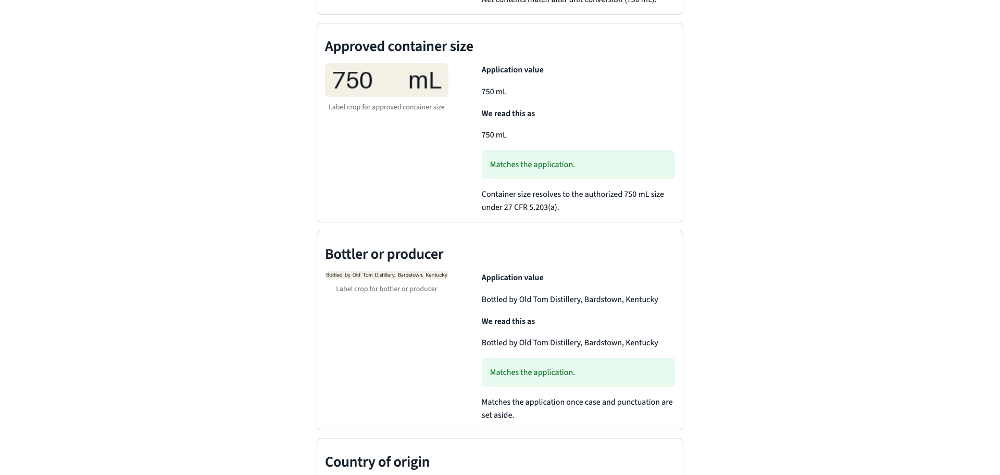
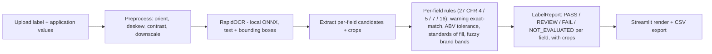

# Alcohol label verification

**Live app:** https://ttb-label-check.streamlit.app
**Source:** https://github.com/junecodetm/ttb-label-check

Hosted on Streamlit Community Cloud rather than HuggingFace Spaces: HF now requires a PRO
subscription for any Space that runs a backend, and only `static` Spaces remain free. The
`Dockerfile` in this repo is still current and verified — `docker build` succeeds and the
container serves on 8501 — so the app can be redeployed to any container host unchanged.

This is an offline tool that checks alcohol label artwork against the field values in a COLA application and shows a compliance agent what matches, what does not, and what still needs human judgment.

**To try it in two clicks:** open the live app, press **Try a sample label**, then press
**Check label**. That loads a bundled label and its application values so you do not have
to find a bottle photograph first.



For batch mode, upload every image in [`samples/`](samples) together with
[`samples/application-values.csv`](samples/application-values.csv). The four samples are
the brief's own acceptance cases: a compliant label, the title-case `Government Warning:`
Jenny Park rejected, a photograph shot at an angle with glare, and Dave Morrison's
`OLD TOM DISTILLERY` versus `Old Tom Distillery`. They are regenerated with
`.venv/bin/python tools/make_samples.py`.

## Setup and run

The project targets Python 3.11. Create the environment and install the application plus development tools with:

```bash
uv venv --python 3.11
uv pip install --python .venv/bin/python -r requirements-dev.txt
.venv/bin/streamlit run app.py
```

`uv venv` does not create `.venv/bin/pip`. Keep using `uv pip install`, with the environment's Python selected as shown above. For a runtime-only local install, use `requirements.txt` instead of `requirements-dev.txt`.

Run the checks with:

```bash
.venv/bin/pytest -q
.venv/bin/ruff check .
```

To build and run the container:

```bash
docker build -t labelcheck .
docker run --rm -p 8501:8501 labelcheck
```

Open `http://localhost:8501`. The image pins Python 3.11 to match the venv and runs as a non-root user; the OCR model weights ship inside the `rapidocr-onnxruntime` wheel, so nothing is downloaded at runtime and a cold start does not pay for a model fetch.

### Deployment note

`packages.txt` installs `libgl1` for the Streamlit Community Cloud deploy. It exists because `rapidocr-onnxruntime` depends on the GUI `opencv-python` distribution, which shares its `cv2` files with the headless wheel pinned in `requirements.txt` and wins on import — so `import cv2` asks for `libGL.so.1` regardless of the pin. The `Dockerfile` solves this at the source by force-reinstalling the headless wheel last; Streamlit Cloud has no equivalent hook, so the system library is installed instead.

Two constraints on that file, both learned by breaking the deploy:

- **Keep it a bare newline-separated list.** Streamlit Cloud passes it directly to `apt`, which treats a `#` comment line as a package name and aborts the whole install with `E: Unsupported file / given on commandline`.
- **Keep it minimal.** `apt` installs the file as one transaction, so a single unsatisfiable package prevents *all* of them from installing. Adding `libglib2.0-0` resolved to a stale Debian 11 build depending on `libffi7`, which took `libgl1` down with it.

**Cold starts:** Community Cloud hibernates an app after ~12 hours without traffic
(limits as published by Streamlit, checked 2026-08-01: 2 vCPU / 2.7GB RAM ceilings). The
first visitor to a sleeping app clicks a wake button and waits roughly a minute for the
container to boot; after that a label checks in about 0.9s. That trade-off comes with
free hosting and is documented rather than papered over — a keep-alive ping cannot click
the wake button. The verified `Dockerfile` is the path to an always-warm host if the 5s
guarantee must also cover the very first request of the day.

## Requirements → features

Each hard constraint in the brief traces to a shipped feature; the full line-by-line
trace with code and test references is in
[docs/requirements-audit.md](docs/requirements-audit.md).

| Requirement (stakeholder) | How it is met |
|---|---|
| Result in under 5 seconds (Sarah Chen) | Local ONNX OCR + image downscaling; measured **0.9s** deployed, p95 1.5s local |
| Batch of 200–300 labels (Sarah / Janet) | Bounded 8-worker pool, per-label progress with time remaining, stop keeps partial results, CSV export; 300 labels in 5m46s |
| "My mother could figure it out" (Sarah) | One path, two-click demo, 52px targets, plain-language verdicts with icon + color, visible keyboard focus |
| Exact government warning, caps checked (Jenny Park) | Normalized **exact** comparison — never fuzzy — with a separate all-caps prefix check and a word-level diff; statutory text verified against GPO + eCFR and pinned byte-for-byte by a test |
| Judgment on brand names (Dave Morrison) | RapidFuzz with PASS / REVIEW / FAIL bands; `STONE'S THROW` vs `Stone's Throw` is an acceptance test, and the tool never auto-rejects |
| Federal firewall blocks cloud ML (Marcus Williams) | Fully offline: OCR weights ship inside the wheel, zero outbound calls on the verification path |
| Container sizes are federally regulated | Net contents checked against the 27 CFR 5.203 / 4.72 authorized size lists (as expanded by T.D. TTB-200), eCFR-verified and provenance-pinned |
| Imperfect photographs (Jenny, stretch) | EXIF orient, deskew, perspective, CLAHE — degrade and say so, never crash |
| Store nothing sensitive (Marcus) | Everything stays in memory; a static test fails the suite if image data ever reaches disk |

## Approach



The actionable verdict model has three states: `PASS`, `REVIEW`, and `FAIL`. A binary verdict was wrong for this work because OCR uncertainty and legitimate near matches, such as capitalization or punctuation differences in a brand name, still need an agent's judgment. `NOT_EVALUATED` is reserved for checks that did not actually run; it is not presented as a passing verdict. The tool flags evidence but never issues a final rejection.

Every field result carries a crop from the source artwork. The report puts that crop next to the application value, extracted value, and reason for the verdict. This is the trust mechanism: an agent can inspect the exact pixels behind a result instead of taking the OCR output on faith.

The rule constants are sourced, not guessed. The statutory warning text, the ABV
tolerances, the authorized container-size lists (including the sizes T.D. TTB-200 added
in 2025), and the warning type-size tiers were each verified against the live eCFR
(title-27 issue of 2026-07-30), anchored as plain-text extracts in
[docs/cfr/](docs/cfr/), and pinned by provenance tests so they cannot drift silently.
Checks the tool cannot honestly run from a photograph — warning boldness, physical type
size — report `NOT_EVALUATED` with the applicable rule quoted, and are never shown
green.

## Tools used

| Tool | Why it is used |
|---|---|
| Streamlit | Provides the single-label and batch user interface with little presentation-layer code. |
| RapidOCR on ONNX Runtime | Runs OCR locally on CPU. Its model weights ship in the wheel, so startup never downloads a model. |
| OpenCV | Decodes images, corrects orientation and perspective, improves contrast, and produces evidence crops. |
| RapidFuzz | Scores fields where a near match should go to human review instead of failing automatically. |
| pandas | Builds batch result tables and CSV exports. |

Everything runs locally and the verification path makes no outbound network calls. That is a hard requirement of the project, not a deployment preference.

## Assumptions and scope

- The image fixtures are synthetic rather than real photographed labels. They prove that the pipeline is wired correctly, not that it has real-world OCR accuracy.
- Batch mode uses a manifest CSV as the application-data channel. Its columns are `filename`, `brand_name`, `class_type`, `alcohol_content`, `net_contents`, `bottler`, and optional `origin_country`.
- Integration with the COLA system is explicitly out of scope. Single-label values come from the form; batch values come from the manifest.
- Uploaded images, extracted text, and crops stay in memory. Nothing is persisted to disk.

## Measured performance

| | Result | How |
|---|---|---|
| One label, deployed | **0.9s**, as the agent sees it | timed in the browser against the live app |
| One label, local | **p50 1.084s / p95 1.511s** | `tools/bench_ocr.py`, 18 samples over 6 variants |
| 300 labels | **5 min 46s**, peak RSS 1110MB, 0 errors | `tools/bench_batch.py --count 300` |

Against Sarah Chen's five-second requirement, a single label costs roughly one to one
and a half seconds warm. OCR is about 95% of that; model load happens once at startup.

An earlier version of this README quoted 0.839s p50. That figure did not reproduce when
re-measured and has been replaced rather than kept — it was taken on a less loaded
machine. Full conditions, the stage split, the batch numbers, and the measurement that
argued *against* building an OCR engine pool are in
[docs/measurements.md](docs/measurements.md).

Accuracy is reported in two parts, because only one of them means much:

- **Synthetic fixtures**: clean, ornate, rotated and glare variants read 18/18 fields;
  low resolution reads 9/18. This shows the pipeline degrades instead of crashing.
- **Real TTB artwork** from the Public COLA Registry: this is what exposed that OCR
  reads stylised labels *without inter-word spaces*, which had been silently costing
  the government warning, the bottler and the alcohol content on real labels. Fixed and
  re-measured; see [docs/measurements.md](docs/measurements.md).

## Security and production hardening

What the prototype already does: processes everything in memory and persists nothing
(enforced by a static test, not just convention); needs no API keys, accounts, or
outbound calls, so there is no secret to leak and nothing for a firewall to block;
rejects uploads over 25MB and non-image files with plain-language messages; and keeps
stack traces out of the browser.

What a production deployment at Treasury would add: an authenticated audit trail and
retention policy before anything is stored at all; rate limiting and malware scanning on
uploads; and — if any hosted model ever replaced the local OCR — it would have to run
inside a FedRAMP-authorized boundary (Azure Government / AWS GovCloud class), because
calling a public model endpoint from a COLA workflow would move label and applicant data
outside the authorization boundary. The local-only design was chosen partly because it
makes that entire class of problem disappear for the prototype.

## Limitations

- Government-warning boldness and minimum type size are `NOT_EVALUATED` rather than guessed.
- Accuracy on real photographs is established for a handful of TTB COLA labels, not a corpus. Curved bottle shots and heavily stylised typography remain the weak spot.
- COLA registry images are composite artwork sheets; side-by-side panels defeat horizontal line grouping. One label per image is the contract.
- There is no COLA integration.
- Nothing is persisted, so there is no history, resumable batch, or audit trail.
- Per-beverage mandatory-field sets and the wine sulfite declaration are not implemented — the application record carries no sulfite data. Wine under 7% ABV does get an FDA-jurisdiction advisory on the alcohol check.
- Image correction degrades gracefully when it cannot recover a poor photograph; the report does not pretend the unreadable evidence passed.

A line-by-line trace from each requirement in the brief to the code and test that
satisfies it is in [docs/requirements-audit.md](docs/requirements-audit.md).

See [limitations and benchmark details](docs/limitations.md) for the measured accuracy results, accepted trade-offs, and remaining production work. The original take-home brief is preserved at [docs/brief.md](docs/brief.md).
